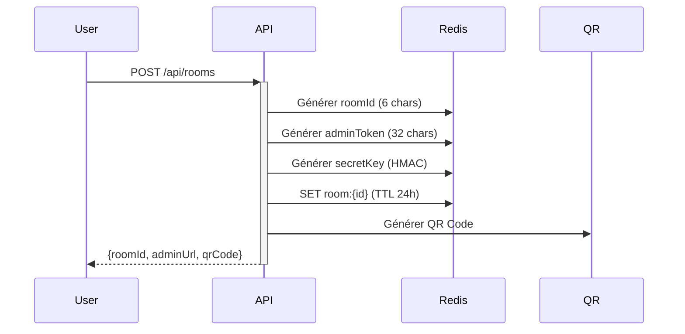
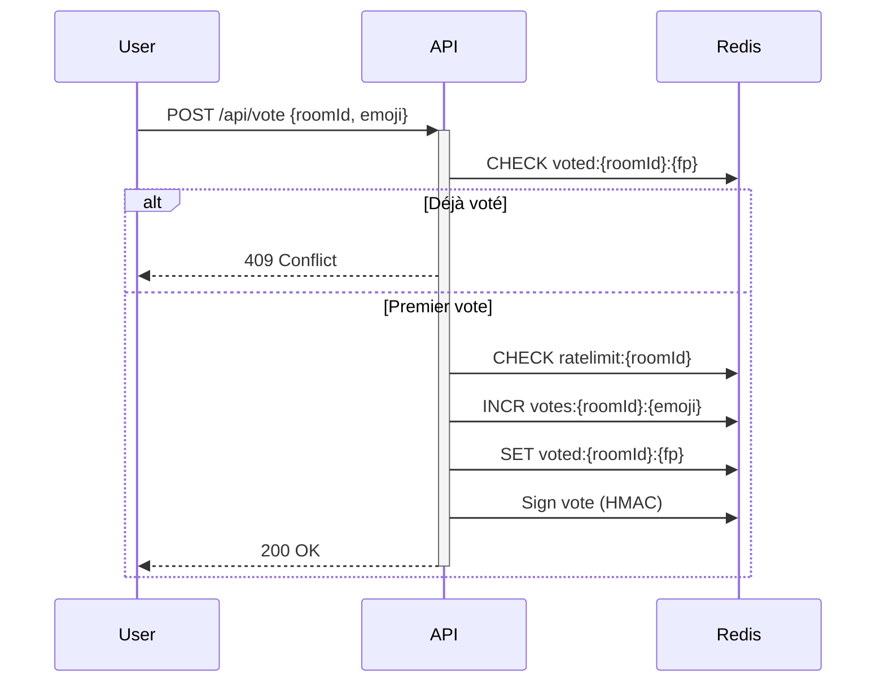
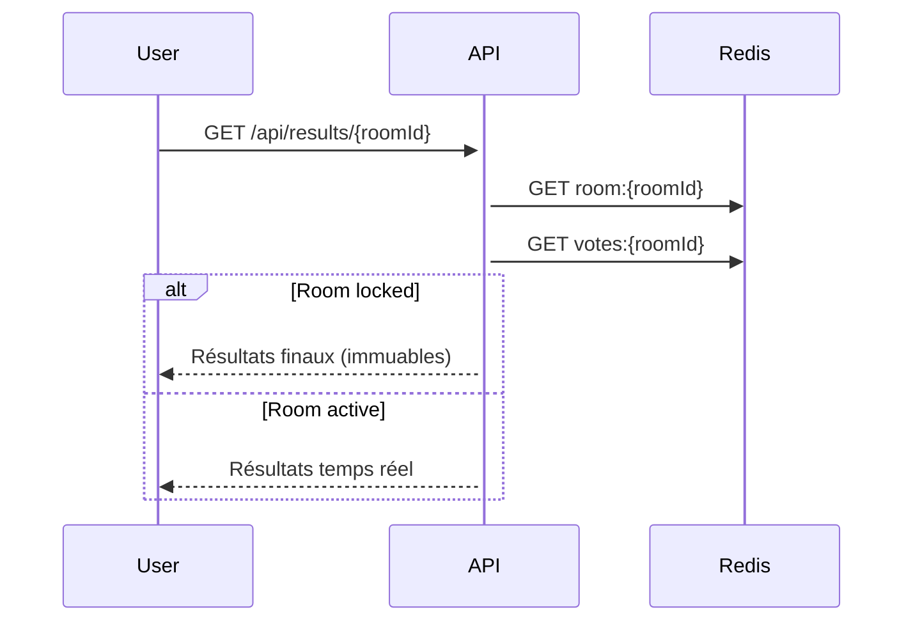

# 🏗️ Architecture Technique

## 🎯 Principes de conception

1. **Privacy by Design** : Zero tracking, zero stockage long terme
2. **Security without Friction** : Protection robuste sans login
3. **Professional Grade** : Utilisable en entreprise/école
4. **Edge-First** : Performance mondiale via Cloudflare

---

## 🗄️ Modèle de données (Redis)

### **Room** (TTL: 24h)
```typescript
room:{roomId} = {
  id: string,              // 6 chars (ex: "ABC123")
  adminToken: string,      // 32 chars (accès admin)
  createdAt: number,       // timestamp
  expiresAt: number,       // timestamp
  question?: string,       // optionnel (v2)
  locked: boolean,         // verrouillage post-clôture
  secretKey: string        // HMAC signing key
}
```

### **Votes** (TTL: 24h)
```typescript
votes:{roomId} = {
  "😍": 42,
  "😊": 28,
  "😐": 15,
  "😕": 8,
  "😢": 3
}
```

### **Fingerprints** (TTL: 24h)
```typescript
voted:{roomId}:{fingerprint} = "1"
// fingerprint = hash(IP + UA + canvasHash)
```

### **Rate Limiting** (TTL: 1min)
```typescript
ratelimit:{roomId} = count
// Max 10 votes/min par room
```

---

## 🔐 Sécurité multi-couches

### **Layer 1 : Anti-spam intelligent**

```typescript
// Fingerprint léger (sans tracking)
function generateFingerprint(request: Request): string {
  const ip = request.headers.get('CF-Connecting-IP')
  const ua = request.headers.get('User-Agent')
  const canvas = request.headers.get('X-Canvas-FP') // client-side
  
  return hash(`${ip}:${ua}:${canvas}`)
}
```

**Pourquoi ça marche :**
- ✅ Bloque les bots simples
- ✅ Empêche les votes multiples (même user)
- ✅ Pas de cookie, pas de localStorage
- ✅ Respecte la privacy (hash non-réversible)

---

### **Layer 2 : Rate limiting**

```typescript
// Cloudflare Workers Rate Limiter
const RATE_LIMIT = {
  perRoom: 10,      // votes/min
  perIP: 5,         // votes/min tous rooms confondus
  cooldown: 3000    // ms entre 2 votes (même user)
}
```

---

### **Layer 3 : Intégrité cryptographique**

```typescript
// Signature HMAC de chaque vote
async function signVote(
  roomId: string, 
  emoji: string, 
  timestamp: number,
  secretKey: string
): Promise<string> {
  const payload = `${roomId}:${emoji}:${timestamp}`
  return await hmacSign(payload, secretKey)
}
```

**Bénéfices :**
- 🔒 Votes non-falsifiables
- 🔒 Détection de manipulation
- 🔒 Audit trail (sans données perso)

---

### **Layer 4 : Séparation admin/public**

```
┌─────────────────────────────────────┐
│  Public URL (vote)                  │
│  /r/ABC123                          │
│  → Lecture seule des résultats     │
│  → Soumission de vote               │
└─────────────────────────────────────┘

┌─────────────────────────────────────┐
│  Admin URL (contrôle)               │
│  /r/ABC123?admin=a1b2c3d4e5f6...   │
│  → Résultats détaillés              │
│  → Verrouillage de la room          │
│  → Export JSON                      │
│  → Fermeture anticipée              │
└─────────────────────────────────────┘
```

---

## 🌐 Flow de données

### **1. Création de room**



### **2. Soumission de vote**



### **3. Consultation résultats**



---

## 🛡️ Privacy & Conformité

### **Ce qu'on NE stocke PAS**

- ❌ Adresses IP (sauf hash éphémère)
- ❌ User-Agent complet
- ❌ Cookies de tracking
- ❌ Historique de navigation
- ❌ Données personnelles

### **Ce qu'on stocke (temporairement)**

- ✅ Hash de fingerprint (24h max)
- ✅ Compteurs de votes (24h max)
- ✅ Métadonnées room (24h max)

### **Garanties**

```
┌─────────────────────────────────────┐
│  Auto-destruction garantie          │
│  Redis TTL natif (pas de cron)      │
│  Pas de backup long terme           │
│  Pas de logs de contenu             │
└─────────────────────────────────────┘
```

---

## 📊 Monitoring (sans tracking users)

### **Métriques techniques autorisées**

```typescript
// Logs infra uniquement
{
  timestamp: number,
  endpoint: string,
  statusCode: number,
  latency: number,
  region: string,        // Cloudflare edge
  error?: string
}
```

### **Métriques interdites**

- ❌ IP complètes
- ❌ Contenu des votes
- ❌ Patterns de comportement
- ❌ Tracking cross-room

---

## 🚀 Déploiement

### **Stack finale**

```
┌──────────────────────────────────────┐
│  Cloudflare Workers (Edge Runtime)   │
│  ↓                                   │
│  Nitro (Framework)                   │
│  ↓                                   │
│  Upstash Redis (Serverless)          │
└──────────────────────────────────────┘
```

### **Régions**

- **Workers** : 300+ edge locations
- **Redis** : Région unique (latence acceptable pour votes)

### **Coûts (Free Tier)**

| Service | Limite gratuite | Dépassement |
|---------|----------------|-------------|
| Cloudflare Workers | 100K req/jour | $0.50/M req |
| Upstash Redis | 10K cmd/jour | $0.20/100K cmd |
| **Total** | **~3000 rooms/jour** | **Quasi-gratuit** |

---

## 🎨 Frontend (minimal)

### **Pages**

1. **`/`** : Landing + création room
2. **`/r/:roomId`** : Vote + résultats publics
3. **`/r/:roomId?admin=...`** : Dashboard admin
4. **`/privacy`** : Politique de confidentialité
5. **`/status`** : Statut du service

### **Tech**

- HTML/CSS/JS vanilla (pas de framework)
- Tailwind CSS (via CDN)
- Alpine.js (interactivité légère)
- Chart.js (graphiques résultats)

---

## 🔮 Évolutions futures (v2+)

### **Features pro**

- [ ] Questions personnalisées
- [ ] Multi-questions (sondage)
- [ ] Export PDF des résultats
- [ ] Webhook de notification
- [ ] API publique

### **Intégrations**

- [ ] Telegram Bot
- [ ] Slack App
- [ ] QR Code physique (impression)

### **Analytics (opt-in)**

- [ ] Comparaison inter-événements (anonymisé)
- [ ] Benchmarks sectoriels

---

*Architecture conçue pour être **simple, sécurisée et scalable**.*
